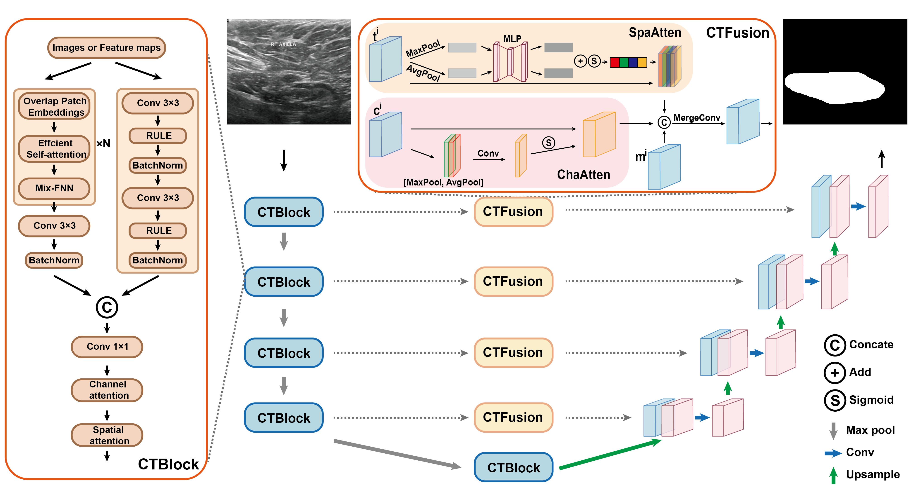

# CTUnet: A Novel Paradigm Integrating CNNs and Transformers for Medical Image Segmentation

We propose CTUnet, a novel network architecture that integrates Convolutional Neural Networks (CNNs) with Transformers. CTUnet primarily consists of two new modules, namely CTBlock and CTFusion. CTBlock integrates CNNs and Transformers in parallel to capture both semantic information and local details of images, thereby achieving a comprehensive representation of images. Additionally, CTFusion replaces the original skip-connection structure in Unet, utilizing spatial and channel attention mechanisms to merge and filter semantic information as well as local details. This process not only transfers local details to the decoder but also minimizes the semantic gap between the encoder and decoder.

